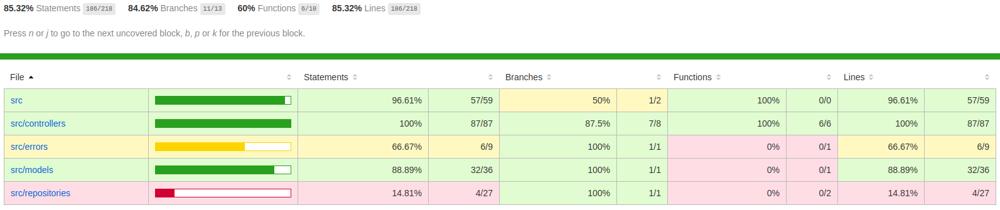
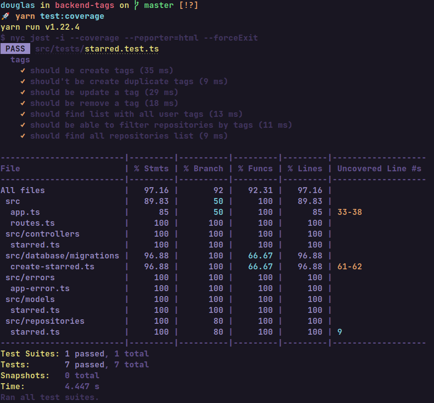

<h1 align="center" >GitTags 👨🏻‍💻</h1>


<br/>

<p align="center">
    <a href="#-projeto">Projeto</a>&nbsp;&nbsp;&nbsp;|&nbsp;&nbsp;&nbsp;
    <a href="#-tecnologias">Tecnologias</a>&nbsp;&nbsp;&nbsp;|&nbsp;&nbsp;&nbsp;
    <a href="#-material-de-apoio">Material de apoio</a>&nbsp;&nbsp;&nbsp;|&nbsp;&nbsp;&nbsp;
    <a href="#-como-baixar">Como baixar</a>&nbsp;&nbsp;&nbsp;|&nbsp;&nbsp;&nbsp;
    <a href="#-cobertura-de-testes">Cobertura de testes</a>&nbsp;&nbsp;&nbsp;|&nbsp;&nbsp;&nbsp;
    <a href="#-sobre"> Sobre </a>

---

## 💻 Projeto

<p align="justify">
    O GitTags, é pra aquele que está sempre procurando novos projetos e curtindo aqueles que são interessantes. E gostaria de poder adicionar uma tag a um repositório para que ele possa ser encontrado facilmente. Por exemplo: encontrei um repositório chamado react e gostaria de adicionar tags `typescript` e `frontend`. Como o GitHub não possui essa funcionalidade, este sistema de forma simples pode ajudar nessa tarefa. <strong>A ideia é ir incrementando sempre um pouco mais </strong> 😏
</p>

---

## 📌 Tecnologias

<p align="justify">
Abaixo estão algumas das tecnologias utilizadas durante o desenvolvimento do projeto. Ainda foi visado: Organizar o diretório da nossa aplicação de forma concisa, limpa e eficiente. Escrever código limpo visando reutilização e eficiência e criar testes unitários e de integração.
</p>
<br>
<p align="center">
  
  
  
  
  
</p>

---

## 🗂 Material de apoio

- [Typescript](https://www.typescriptlang.org/)
- [PostBird](https://github.com/Paxa/postbird)
- [TypeORM](https://typeorm.io/#/)
- [Express](https://expressjs.com/pt-br/)
- [Jest](https://jestjs.io/)
- [Istanbul](https://istanbul.js.org/docs/tutorials/jest/)

---

## ⬇️ Como baixar

```bash
    // Clonar repositório
    $ git clone https://github.com/douglasconstancio/backend-tags.git

    // Acessar diretório
    $ cd backend-tags

    // Instalar dependências
    $ yarn

    // Iniciar projeto
    $ yarn dev

    // Executar testes automatizados
    $ yarn test

    // Verificar cobertura de código dos testes
    $ yarn test:coverage
```
---

## 📊 Cobertura testes:

**HTML:**



**Terminal:**



## 🔖 Sobre

<p align="justify">
Esse projeto foi desenvolvido com base na <a href="https://github.com/magrathealabs/template-projeto-selecao/blob/master/projects/GITHUB.md"> proposta</a> de projeto da MagratheaLabs.

</p>
